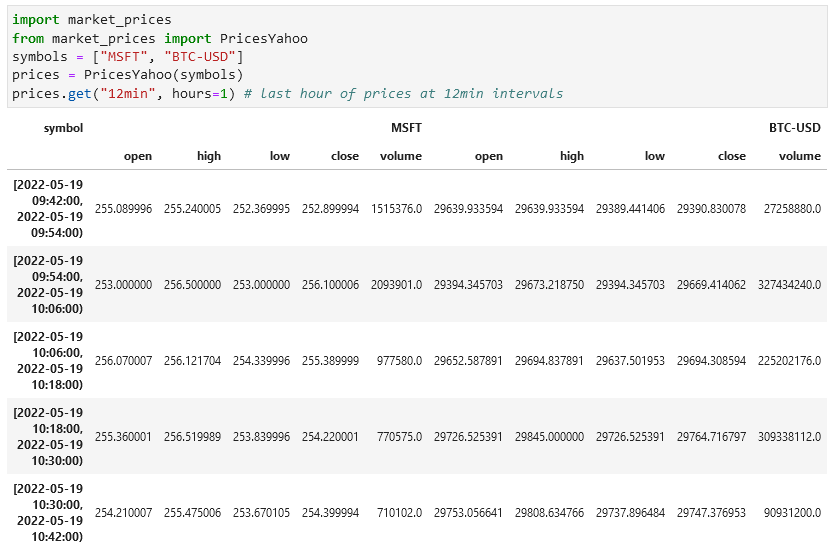

<!-- DEFINE ALL LINKS AS ABSOLUTE address so that resolve on PyPI page -->
# market_prices

[](https://pypi.org/project/market-prices/)  [](https://github.com/psf/black)

A python library to create **meaningful** OHLCV datasets.

Works out-the-box with prices from the Yahoo Finance API (see [Disclaimers](https://github.com/maread99/market_prices#disclaimers)).



## Features include:
* Include **securities trading on different exchanges** with differing opening hours across different time zones.
* Request the **period** covered by a dataset in terms of either:
    * trading time (minutes and hours)
    * number of sessions
    * calendar time (weeks, months and years)
* Request data at **ANY interval** (pretty much).
* Use properties and functions of the **`pd.DataFrame.pt` accessor** to interrogate and operate directly on price tables.
* **Anchor** indices either:
    * on each (sub)session open.
    * on the period end and work back (crossing sessions).
* Price tables indexed with a pandas `IntervalIndex` that defines both sides of the time interval covered by each row.
* Respects **breaks** in exchanges that observe separate morning and afternoon subsessions.
* Indices excluded for any periods when no underlying exchange is open.
* Fills **missing prices**, by security, within the bounds of trading hours (zero leakage).
    * Optionally fills missing values outside of trading hours (for multiple securities with different opening hours).
* **Efficient data-usage** (only requests data required and only requests any data point once).

## Installation

```bash
$ pip install market_prices
```

pip will also take care of installing any missing dependencies.

Although not a dependency, it's anticipated that `market_prices` will be used within a [Jupyter](https://jupyter.org/) environment (JupyterLab or a Jupyter Notebook).

## Tutorials / Documentation
`market_prices` comes with a host of notebook [tutorials](https://github.com/maread99/market_prices/blob/master/docs/tutorials_docs.md#tutorials) that show example usage and explain every aspect of what's on offer. Check out [quickstart.ipynb](https://github.com/maread99/market_prices/blob/master/docs/tutorials/quickstart.ipynb) for a taster.

All tutorials and other documentation are indexed [here](https://github.com/maread99/market_prices/blob/master/docs/tutorials_docs.md).

Each method's own documentation is also pretty comprehensive.

## exchange_calendars

`market_prices` is nothing without [`exchange_calendars`](https://github.com/gerrymanoim/exchange_calendars).

`exchange_calendars` provides `market_prices`:
* Knowledge of underlying exchanges' opening times.
* A wealth of functionality to interrogate exchanges' sessions and trading minutes.

This knowledge and functionality allows `market_prices` to:
* Index prices according to exchanges' opening hours.
* Evaluate periods defined in terms of trading minutes or sessions.

### Calendar maintenance

If you come across missing prices or sessions then the first port of call is to check that the associated calendar is accurate - it may need updating.

* If prices are not included for a session, the calendar may be assuming that day is a holiday.
* If prices are included on a day when the exchange was closed, the calendar is probably assuming that day represents a trading session. In this case prices for the non-trading day will have a constant value and a `errors.PricesMissingWarning` will have been raised when the prices were requested.

All calendars are maintained by user-contributions. If you find one that needs updating, PR the required changes over at `exchange_calendars` and it'll filter into `market_prices` on the next `exchange_calendars` release. Links to the workflow to update calendars can be found [here](https://github.com/gerrymanoim/exchange_calendars#frequently-asked-questions).

The [prices tutorial](https://github.com/maread99/market_prices/blob/master/docs/tutorials/prices.ipynb) covers how `market_prices` associates calendars with symbols.

## Release schedule, bugs, development and feedback

The first beta version of `market_prices` was released May 2022.

Whilst the test suite is pretty comprehensive, there will inevitably be bugs. Please do raise an [issue](https://github.com/maread99/market_prices/issues) with any that you come across. Even better, offer a PR! Contributions welcome.

Please use [discussions](https://github.com/maread99/market_prices/discussions) to make any suggestions and offer general feedback.

A new beta release will be made to coincide with the release of `exchange_calendars` [version 4.0](https://github.com/gerrymanoim/exchange_calendars/issues/61). The public interface will remain unchanged although the minimum version of the `exchange_calendars` dependency will be advanced to 4.0 to allow for some of the internals to be cleaned up.

## Disclaimers

`market_prices` should not be assumed sufficiently reliable to undertake market analysis intended to inform investment decisions. Users should inspect the source code and the test suite of the library and its dependencies in order to make their own assessment of the packages' suitability for their purposes. **`market_prices` is used entirely at the user's own risk.**

### **Yahoo APIs**

The default `PricesYahoo` class requests data from publically available Yahoo APIs via the [yahooquery](https://github.com/dpguthrie/yahooquery/) package.

**`market_prices` is NOT in any way affiliated, partnered, sponsored or endorsed by Yahoo. Users of the `PricesYahoo` class should make enquiries to satisfy themselves that they are eligible to receive data from  _Yahoo APIs_ and are in compliance with the license requirements and Terms of Service under which the _Yahoo APIs_ may be accessed, to include restrictions concerning NO COMMERCIAL USE.**

Users may find the following references useful in this respect. (These references should not be considered to definitively cover all terms and conditions related to the use of _Yahoo APIs_.)

* [Yahoo Developer API Terms of Use](https://legal.yahoo.com/us/en/yahoo/terms/product-atos/apiforydn/index.html)
* [Yahoo Terms of Service](https://legal.yahoo.com/us/en/yahoo/terms/otos/index.html)
* [Yahoo Terms index](https://policies.yahoo.com/us/en/yahoo/terms/index.htm)

Further, it should NOT be assumed that price data returned by the `PricesYahoo` class will accurately reflect data as provided by _Yahoo APIs_. In this respect users should make their own inspection of the source code and test suites of `market_prices` and its dependencies.

## License

[MIT License](https://github.com/maread99/market_prices/blob/master/LICENSE.txt)